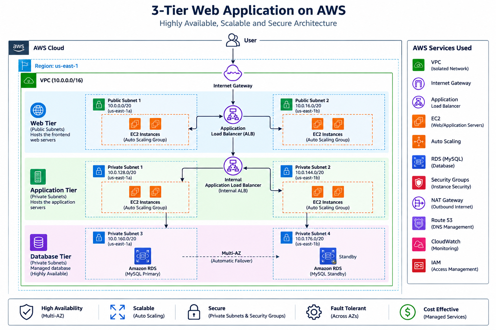

# aws-3-tier-architecture
Highly available 3-tier AWS architecture using VPC, EC2, ALB, Auto Scaling, and RDS across multiple Availability Zones.
# AWS 3-Tier Web Application Architecture

## Project Overview

This project demonstrates the design and implementation of a **highly available, scalable, and secure 3-tier web application architecture on AWS**.

The architecture separates the application into three distinct layers: Web Tier, Application Tier, and Database Tier. Each tier is deployed within an Amazon VPC using public and private subnets across multiple Availability Zones.

The design uses AWS services such as Amazon EC2, Application Load Balancer, Auto Scaling, Amazon RDS, NAT Gateway, and security groups to support application availability, scalability, and controlled network access.

## Architecture Overview

The application consists of three main tiers:

### 1. Web Tier (Public Subnets)

The Web Tier hosts the frontend web servers using Amazon EC2 instances in public subnets. An Application Load Balancer distributes incoming user traffic across the web servers, while Auto Scaling helps maintain the required number of instances.

### 2. Application Tier (Private Subnets)

The Application Tier contains application servers deployed in private subnets. An internal Application Load Balancer distributes requests from the Web Tier to the application servers.

The application servers are isolated from direct public access to improve network security.

### 3. Database Tier (Private Subnets)

The Database Tier uses Amazon RDS for database management. The database is deployed within private subnets and is accessed by the Application Tier through controlled security group rules.

## Request Flow

```text
User
  ↓
Internet Gateway
  ↓
Public Application Load Balancer
  ↓
Web Tier (EC2 Auto Scaling)
  ↓
Internal Application Load Balancer
  ↓
Application Tier (Private EC2)
  ↓
Database Tier (Amazon RDS)
```

## AWS Services Used

* **Amazon VPC:** Provides an isolated network environment.
* **Amazon EC2:** Hosts web and application servers.
* **Application Load Balancer:** Distributes traffic across servers.
* **Auto Scaling:** Helps maintain application server capacity.
* **Amazon RDS:** Provides managed database services.
* **NAT Gateway:** Enables outbound internet access from private subnets.
* **Internet Gateway:** Provides internet connectivity for the VPC.
* **Security Groups:** Control inbound and outbound instance traffic.
* **Bastion Host:** Supports administrative access to private resources, where configured.

## Security Implementation

* Web servers are deployed in public subnets.
* Application and database servers are deployed in private subnets.
* Security groups control communication between the tiers.
* Database access is restricted to authorized application servers.
* Network components are distributed across multiple Availability Zones.

## Key Features

* Three-tier application architecture
* Multi-AZ deployment design
* Load balancing and Auto Scaling
* Public and private subnet separation
* Controlled communication between application tiers
* Managed database infrastructure

## Key Learnings

* Designing AWS VPC architecture
* Configuring public and private subnets
* Implementing Application Load Balancers
* Configuring EC2 Auto Scaling
* Understanding tier-based security
* Integrating application servers with Amazon RDS
* Building scalable and highly available cloud infrastructure

## Architecture Diagram


